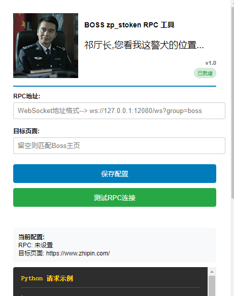

## zp_stoken RPC 工具

## 介绍 (为什么会有这么个扩展)

### 弄过这个逆向的小伙伴应该知道,zp_stoken是一个cookie加密手段，带上才能获取正确的参数
### 正常逆向或者补完环境结束当天确实可以使用，但是网站会每天刷新js加密文件,会变一小部分环境和js文件的路径
### 可能确实有办法在nodejs中动态修改环境之类的操作，我比较懒...
### 
### 用rpc就不用考虑这个问题,不过rpc也有一点问题：
> 1.需要将入口函数就是这个js导出到全局,每天需要把RPC代码和js文件手动注入到浏览器中或者用油猴脚本,也要每天复制一次，那不白RPC了嘛

> 2.油猴脚本注入js文件时机太晚，导致js文件还没有注入到浏览器中，导致RPC无法通过油猴动态导出加密方法


## 扩展功能

> 1.✅ 提前hook 加载js文件的地方
> 
> 2.✅ 自动注入JsRpc客户端
> 
> 3.✅ 到第二天自动刷新页面，也就自动刷新js文件
> 
> 4.✅ 扩展页面可以定制需要注入的链接路由和RPC地址


### 使用流程:
> 1.下载 https://github.com/jxhczhl/JsRpc  (吊的一比)
>> cmd 进入JsRpc目录
> 
>> 运行 window_amd64.exe
> 
> 2.下载源码
> 
> 3.文件夹拖到管理扩展程序面板中
> 
> 4.配置 RPC地址 和 匹配的链接
> 
> 5.打开控制台,查看打印日志

### 成品效果


## Python请求实例代码
```python
import requests
import json,time
def getToken_rpc(__zp_sseed__, __zp_sts__):
    while 1:
        try:
            data = {
                "group": "boss",
                "action": "data_encode",
                "param": json.dumps({"seed": __zp_sseed__, "ts": __zp_sts__})
            }
            res = requests.post('http://127.0.0.1:12080/go', data=data)
            data_rpc = res.json()['data']
            if data_rpc == '没有找到对应的group或clientId,请通过list接口查看现有的注入':
                print(f'暂无法连接 rpc zp_stoken接口，等待10秒... {data_rpc}')
                time.sleep(10)
            else:
                print(data_rpc)
                data_rpc = json.loads(data_rpc)
                zp_token = data_rpc['zp_token']
                user_agent = data_rpc['user-agent']
                print(f"rpc __zp_token__: {zp_token}")
                return zp_token
        except Exception:
            # print_exc()
            print('暂无法连接 rpc zp_stoken接口，等待10秒...')
            time.sleep(10)
```

